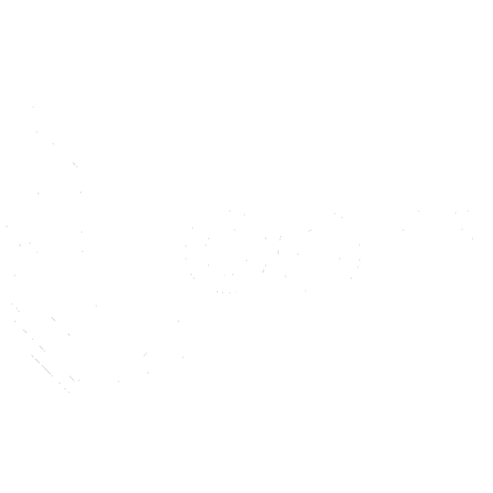

# Loom

A node-based editor for chaining AI image, video, and text generation. Runs entirely in your browser — you bring your own API keys, and requests go straight from your browser to the provider. No backend, no accounts, no credits to buy.

<p align="center">
  
</p>

## Why

Most hosted node editors for AI generation resell API access at a markup and lock your work behind their billing. If you're already paying OpenAI or Google directly, there's no reason to also pay someone else's per-credit fee on top.

Loom is the editor without that part. Your keys live in `localStorage`.

## What works today

**50 models** across image and video, picked from a searchable catalog on every generator node. Full list: [docs/models.md](docs/models.md).

- **Video:** Seedance 2.5 (incl. multi-reference), Seedance 2.0, Kling v3 Pro/Standard, Kling O3, Kling 3.0 / 2.6, Veo 3.1 (+ Fast/Lite), Sora 2 & Sora 2 Pro, MiniMax H3 / H3 Max, Hailuo 2.3, Wan 3.0 (+ Prime), Grok Imagine Video 1.5, Gemini Omni Flash 1.1, FLUX 3 Video, LTX Video 2.3, PixVerse V6
- **Image:** Nano Banana 2 & Nano Banana Pro (Gemini 3.x Image), GPT Image 2 and 2.5 (Flare/Sunburst), FLUX 2 Pro/Max, Seedream 5.0 Pro & 4.5, Qwen Image 3, Ideogram V4, Recraft V4.1, Krea 2, Grok Imagine Image 2.0
- **Text:** Gemini 3.8 Flash / 3.5 Flash-Lite / 3.1 Pro for prompt engineering

You can chain these however you want — e.g. text node refines a prompt → image node generates → that image becomes a video's start frame.

Video nodes expose a separate input dot per image role the chosen model supports — start frame, end frame, subject references — so a generated image can drive interpolation or subject consistency without guesswork. Unsupported roles simply don't appear.

Most models run through [fal.ai](https://fal.ai), so a single key covers the bulk of the catalog. Some are also available against the vendor's own API — Google, OpenAI, BytePlus ModelArk or Kling — using your own key, no middleman. Each entry in the model picker is tagged with the backend it calls.

## Running it

```bash
git clone https://github.com/theodoreiulian/loom.git
cd loom
npm install
npm run dev
```

Needs Node 18+. Open the settings panel in the header to paste your API keys. There are short walkthroughs in the app for each provider if you haven't generated a key before.

Start with a fal.ai key — it unlocks most of the catalog. Add Google, OpenAI, BytePlus or Kling keys if you want to call those providers directly.

One caveat: Kling's API sends no CORS headers, so models tagged `kling` only work under `npm run dev`, which proxies them. Every other backend is reachable straight from the browser, including a production build.

```bash
npm test              # unit + pipeline tests
npm run verify:models # check the catalog against fal's live schemas (network)
npm run lint
npm run build
```

## Demos

Setup and key management:

https://github.com/user-attachments/assets/54312b8a-7c8e-4186-bdd7-82488e327a9b

Text-to-image with an LLM prompt-refiner in the middle:

https://github.com/user-attachments/assets/f0d4b4b1-77a1-4002-8830-0262a492d682

Text + reference image to image:

https://github.com/user-attachments/assets/96f41ce9-bc4b-49e2-8ada-4a445058f225

## Stack

React 19, Vite, TypeScript, XYFlow for the graph, Tailwind 4 for styling, Vitest for tests.

Models live in a declarative registry (`src/models/`) that drives the settings UI, the request payloads and validation; provider adapters live in `src/api/providers/`. Adding a model is one object in a catalog file — see [docs/models.md](docs/models.md#adding-a-model).

## Contributing

Missing a provider? Replicate, Runway, Luma, local SDXL via a server URL, audio models — open a PR. New fal-hosted models are usually a single catalog entry; new backends need a small adapter in `src/api/providers/`.

Beyond new providers, there's plenty of room for ideas that change how the editor itself works: batch runs, looping nodes, conditional branches, saving/loading graphs, sharing presets, better caching of intermediate outputs.

## License

This project is licensed under the MIT License - see the [LICENSE](LICENSE) file for details.